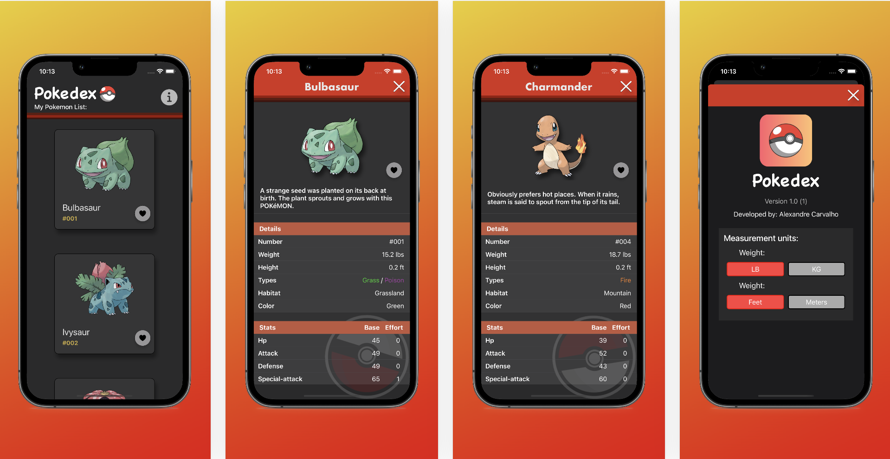
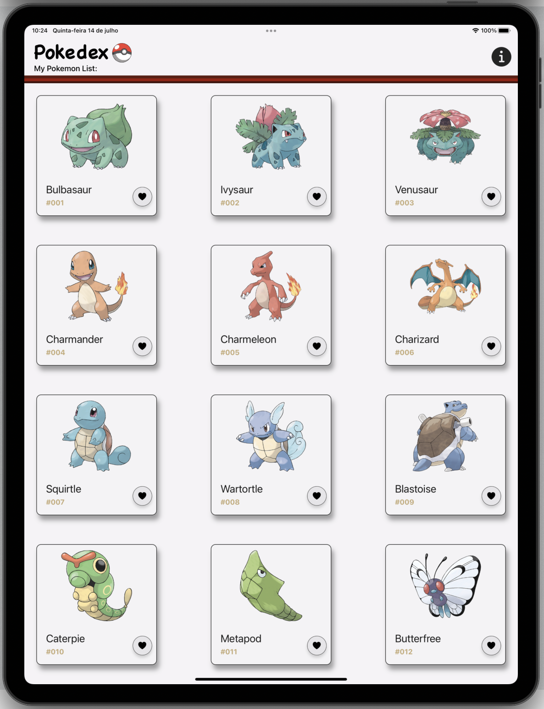

# Pokedex

## About Pokedex
Pokedex is a small iOS app, which lists all the Pokémons and their special abilities and features.
This application is prepared for different screens of different sizes as well as screen orientation changes.

Pokedex is built on MVVM (model-view-viewmodel), which allows you to separate developments from the backend logic (the model) from the graphical interface (the view); and so the ViewModel deals with the view's display logic.
The api that powers this entire application is the: https://pokeapi.co/

## App Notes:
- To ensure quality this app contains a test target that will execute automatic tests of the most crucial parts of the app. (Unit Testing and UI Testing);
- This application works in dark mode without any problems;
- To ensure this app is used by a bigger audience all screens are compatible not only in portrait mode but also in ladscape mode for iOS and iPadOS.
- The app allows you to choose the units of measurement to use in the settings.
- This app has paginated information using infinite scroll mode
- This apps use the Cocoapod SDWebImage. The use of these is free under the MIT licencing model.
- The webhook.site url used in this solution is: https://webhook.site/a3880550-89fa-4eda-a17f-abe030967545

### App preview - Light Mode

### App preview - Dark Mode

### Ipad Mode

